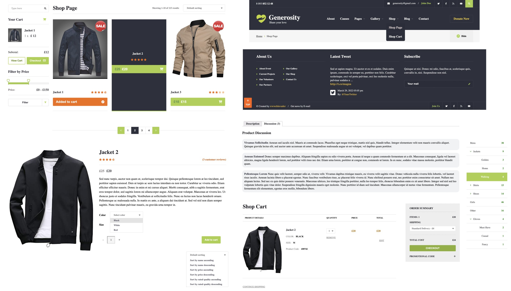

# React repository with Typescript

Single page applications are implemented using React with Typescript. React is used as frontend web development library. Typescript is used as type safe javascript. For state management is used Redux. For client side routing is used React Router. SCSS is compiling and merging sass files to the final CSS file. All code is client side and static json data is get from public assets directory.

## Pages

Following examples are using React with Typescript, Redux, React Router and SCSS.

### Steps for running example

To run example 1, follow steps below:

1. Go to directory for example 1:

    ```shell
    cd primeri/primer1
    ```

2. Install all npm libraries:

    ```shell
    npm install
    ```

    All libraries will be installed in _primeri/primer1/node_modules_. If _node_modules_ already exists, remove it and start installation again.

3. Run react scripts:

    ```shell
    npm start
    ```

    After running scripts, localhost page on port 3000 will be opened in [browser](http://localhost:3000/).

### Example 1

Web shop is implemented with the most common features. [Shop](http://localhost:3000/shop-page) page is used for shopping articles, while shopping [cart](http://localhost:3000/shop-cart) is used to checkout articles.

In the header there is menu with dropdowns. All menu items are routed. Below header is breadcrumbs menu showing navigation links. Shop page containts articles which can be added to cart. Articles can be sorted by name, price or number of stars (quality) in both orders. Pagination is added to the bottom of shop page. On the left side, there are search bar, cart, filters, top products and articles tags. Search bar is searching for all articles and show them on the page. Cart contains all added articles. Filters use price and menu filters. Price filter with two ranges is implemented from scratch using mouse events. Menu filter contains all (sub) categories of articles. Applied filters are added to the url and page can be bookmarked and routed. Top rated products shows articles which are the most stars rated. Articles tags are grouping all existing tags for articles.

Each article has its own page. Article page contains image, info text, description and all comments for given article. Color, size and number of articles can be adjusted. Star system is implemented and while hovering over it, stars rating can be directly updated. Article can be added to cart. Inside cart page, there are descriptive details about each article. Articles can be removed, changed or finally checkout with some kind of shipping and w/o promotional code. Footer validates and subscribe email address.

Link to [example](https://github.com/pancogit/react_repo/tree/main/primeri/primer1).


